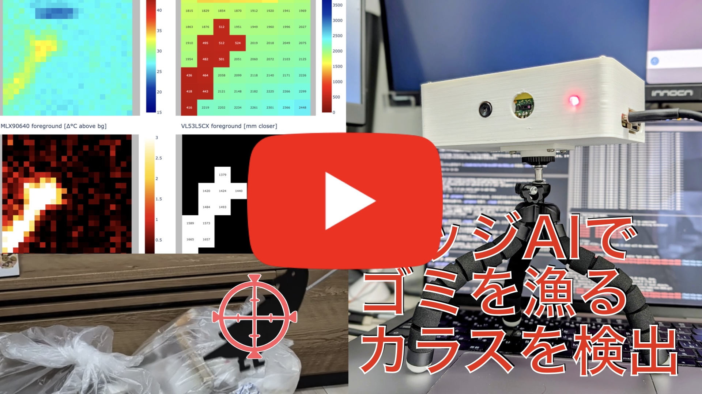
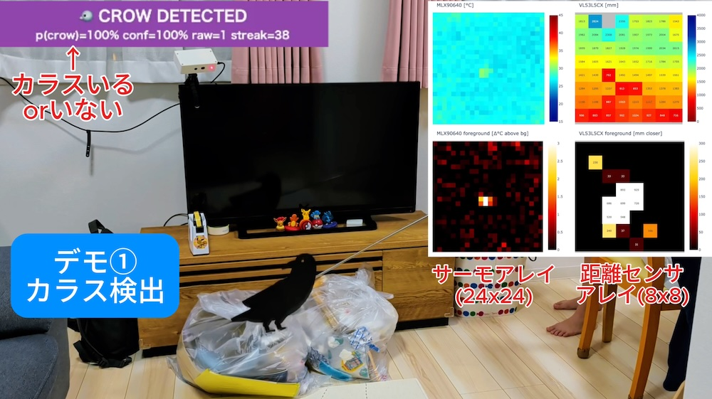

<p align="center">
  
</p>

<p align="center">
  <b>カメラを使わない、ネットにつながない。<br>
  1 枚のマイコンだけで「カラスがいる」と気づくエッジAI。</b>
</p>

<p align="center">
  <a href="https://protopedia.net/event/digikey2026">DigiKey Make ONE Challenge 2026</a> 応募作品 ／ 使用ボード: <b>NXP FRDM-MCXN947</b>（おすすめ製品）
</p>

---

## 🎥 デモ動画（2分）

[](https://youtu.be/Pb8VNFVwH3w)

> サムネイルをクリックで YouTube が開きます → **https://youtu.be/Pb8VNFVwH3w**

---

## これは何？

**TerraGuard AI** は、ゴミ置き場を荒らすカラスを検出するエッジAIです。
カメラの代わりに **低解像度サーマルセンサ（32×24）** と **距離センサ（8×8）** だけを使い、
**NXP FRDM-MCXN947 という 1 枚のボード上**で、取得 → AI推論 → 検出までを完結させます。

カラスは「**暖かくて（羽毛表面 約30〜35℃）・背景より手前に出た・小さなまとまり**」として現れます。
温度と距離を 1 つの小さな AI（CNN）に同時入力し、約1.4秒の連続検出で確定判定します。

| | |
| --- | --- |
| 🛰 **インターネット接続 不要** | 取得〜推論〜判定まで全部オンボード。クラウドに 1 バイトも送らない。 |
| 🔋 **低消費電力** | 推論はオンチップの **eIQ Neutron NPU**（実測 推論1回 約0.2ms）。 |
| 🔒 **プライバシー配慮** | カメラレス。32×24＋8×8 の低解像度では人物が判別できる映像が原理的に存在しない。 |
| 🧩 **追加ボード 0** | 中継用 Arduino 等は不使用。センサを FRDM-MCXN947 に直接 I2C 接続。 |

> **今回のスコープは「カラス検出」**。これは**カラス追い払いソリューションの第一歩**で、
> 次の展開は検出をトリガーにした **緑色レーザーによる追い払い**です。

---

## ✨ この作品の「イチ（ONE）」

本コンテストのテーマ「**1（イチ）**」に、性質の違う 3 つの「1」を重ねました。

1. **ONE chip** — たった 1 枚の MCU だけでエッジAIを完結（クラウド0・追加ボード0・カメラ0）
2. **ONE crow** — たった 1 羽の侵入者も見逃さない、プライバシー配慮型の番人
3. **ONE first** — 私にとって “1 回目” の、**人間がコードを 1 行も書かない完全AIファームウェア開発**

詳しくは [docs/protopedia/story.md](./docs/protopedia/story.md) を参照してください。

---

## 📸 デモの様子

| カラス検出（ダミーガラス） | 人がいても誤検出しない |
| :---: | :---: |
|  |  |
| **CROW DETECTED**（p=100%）。サーマルと距離に「暖かく手前のまとまり」が出ている。 | **not crow**。人が写っても、温度・距離のパターンが違うため誤検出しない。 |

右側の 4 分割は、ホスト側ビューア（`tools/dual_viewer_web.py`）で可視化したサーマル/距離とその前景です。

---

## 🔧 ハードウェア

| 完成体（3Dプリント外装＋三脚） | 中身（FRDM-MCXN947 ＋ センサ2個） |
| :---: | :---: |
|  |  |

| 要素 | 内容 |
| --- | --- |
| 開発ボード | **NXP FRDM-MCXN947**（デュアル Cortex-M33 + DSP + **eIQ Neutron NPU**、オンボード MCU-Link） |
| サーマルセンサ | **MLX90640**（32×24, I2C 0x33） |
| 距離センサ | **VL53L5CX**（ToF 8×8, I2C 0x29） |
| 外装 | Autodesk Fusion で 3D 設計し 3Dプリンタで製作 |

センサは同一 I2C バス（J8 pin1〜4）に直結。配線・ピン配置は [docs/hardware.md](./docs/hardware.md) を参照。

---

## 🧠 どうやってカラスを見分けるか

サーマルと距離をそれぞれ背景差分で「いま現れたもの（前景）」にし、
**4 チャンネル 24×24 のテンソル**にまとめて、オンチップの NPU で動く小型 CNN に通します。

<p align="center">
  
</p>

ロジックの詳細は [docs/sensor-processing.md](./docs/sensor-processing.md)、
学習データの作り方は [docs/dataset.md](./docs/dataset.md) を参照してください。

---

## 🤖 完全AIファームウェア開発

本作のファームウェアは、**AI コーディングエージェント Claude Code が実装**しました。
制作者（人間）は **コードを 1 行も書かず・1 度も開かず**、ビルド・書き込み（flash）・学習コマンドの実行も**すべて AI がハンドリング**しています。

これを支えたのが、**FRDM-MCXN947 開発用に自作した「スキル」**です。
ビルド／書き込み／シリアル確認／NPU学習などの確定手順とハマりどころを AI 向けに記述しており、
AI はスキルを起動するだけで毎回ブレずに実機開発を進められます。

→ 仕組みと再現方法は [docs/dev-skill.md](./docs/dev-skill.md) を参照。

### 開発体制（人間 × AI）

| 担当 | 役割 |
| --- | --- |
| **キッズクリエーター かなた** | 発案、意匠デザイン、デモデザイン |
| **Claude Code**（AIエージェント） | ファームウェア開発、学習モデルデザイン |
| **かなたパパ** | AI の進捗管理、開発しやすい環境構築、はんだづけ |
| **かなた ＋ かなたパパ**（協働） | 外装の 3D 設計（Autodesk Fusion）・3Dプリント |

---

## 🚀 はじめかた

### センサ可視化ツール（PC側）

FRDM-MCXN947 がシリアル出力するサーマル/距離フレームをブラウザでリアルタイム可視化します。

```bash
cd tools
uv sync --all-extras                 # uv 推奨（pip の場合は pip install -e ".[web,gui]"）
uv run python dual_viewer_web.py     # → http://127.0.0.1:8050
```

### ファームのビルド・書き込み・再学習

NXP 開発（ビルド／flash／学習）は専用スキルに手順を集約しています。
→ [docs/dev-skill.md](./docs/dev-skill.md) ／ [docs/firmware.md](./docs/firmware.md) ／ [docs/ml-model.md](./docs/ml-model.md)

---

## 📁 リポジトリ構成

```text
.
├─ src/FRDM-MCXN947/   FRDM-MCXN947 の MCUXpresso SDK プロジェクト（ファーム本体）
├─ tools/              PC側のセンサ可視化・データ収集・学習ツール（Python）
├─ dataset/            学習データ（raw/=生サンプル, validation/）。built/ は再生成物
├─ docs/               プロジェクトドキュメント（日本語）
│  └─ protopedia/      ProtoPedia 掲載用（ストーリー・システム構成）
└─ images/             ロゴ・デモ・テスト画像
```

---

## 📚 ドキュメント

| ドキュメント | 内容 |
| --- | --- |
| [docs/protopedia/story.md](./docs/protopedia/story.md) | **ストーリー**（課題・3つの「イチ」・完全AI開発） |
| [docs/protopedia/system.md](./docs/protopedia/system.md) | **システム構成**（1チップ完結・部品表） |
| [docs/overview.md](./docs/overview.md) | 課題・ソリューション概要・全体アーキテクチャ |
| [docs/hardware.md](./docs/hardware.md) | 使用部品・配線・ピン配置 |
| [docs/sensor-processing.md](./docs/sensor-processing.md) | センサ処理・特徴量・カラス検出ロジック |
| [docs/dataset.md](./docs/dataset.md) | 学習データの作り方・`dataset/` 構成 |
| [docs/ml-model.md](./docs/ml-model.md) | 学習〜int8量子化〜NPUデプロイ |
| [docs/firmware.md](./docs/firmware.md) | FRDM-MCXN947 開発・ビルド・書き込み |
| [docs/dev-skill.md](./docs/dev-skill.md) | FRDM-MCXN947 開発用スキルの解説 |
| [docs/roadmap.md](./docs/roadmap.md) | 開発ステップ・追い払い機構の拡張 |

ドキュメントの入口は [docs/README.md](./docs/README.md) です。

---

## 🔗 関連リンク

- **[ProtoPedia 作品ページ](https://protopedia.net/prototype/8589)**
- **[デモ動画（YouTube）](https://youtu.be/Pb8VNFVwH3w)**
- **[DigiKey myLists 部品リスト](https://www.digikey.jp/ja/mylists/list/QGSF94NSJU)**
