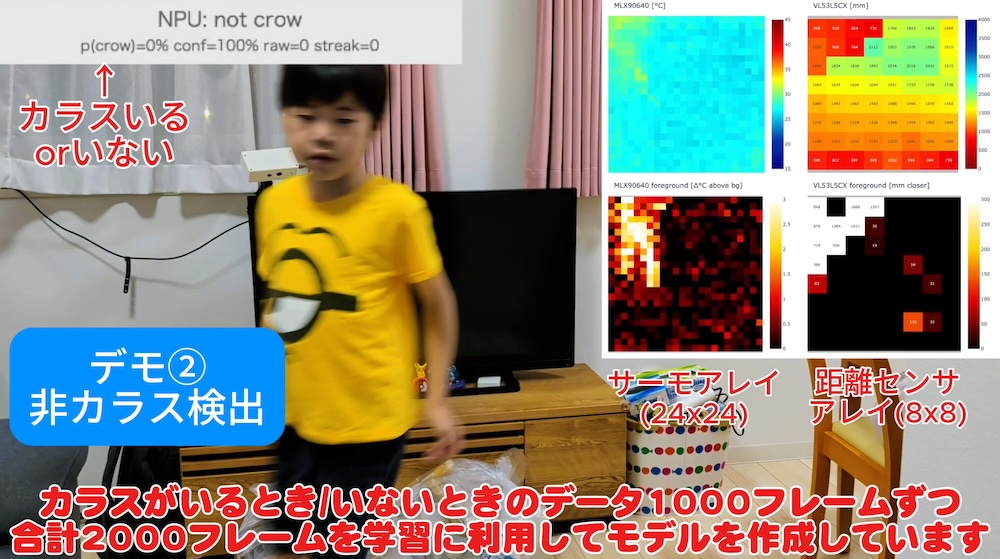

# 学習データセット — 作成方法と `dataset/` 構成

TerraGuard AI のカラス検出モデル（2クラス: `not_crow` / `crow`）の**学習データの作り方**と、
`dataset/` ディレクトリの**中身・再現手順**をまとめる。

> **データの流れ（全体像）**
>
> ```text
> 実機(FRDM-MCXN947) ──シリアル──▶ collect_dataset.py ──▶ dataset/raw/*.npz
>                                       (ライブ収集・キーでラベル付け)   (1サンプル=1ファイル)
>                                                                          │
>                                              build_trainset.py ◀─────────┘
>                                                       │
>                                                       ▼
>                                            dataset/built/X.npy, y.npy, meta.json
>                                                       │
>                                              train_model.py（int8量子化）
>                                                       ▼
>                                       NPU変換 → モデルヘッダ → ファーム書き込み
> ```
>
> 学習〜NPUデプロイの後半（量子化・neutron変換・ヘッダ生成・書き込み）は [ml-model.md](./ml-model.md) を参照。
> 前処理ロジックの背景は [sensor-processing.md](./sensor-processing.md) を参照。

---

## 1. `dataset/` ディレクトリ構成

```text
dataset/
├── raw/          ★ 実機から収集した生サンプル（1サンプル = 1 .npz）。再現の元データ。
│   └── sample_000000.npz, sample_000001.npz, ...
├── built/        build_trainset.py が raw から生成する学習テンソル（派生物・再生成可能）。
│   ├── X.npy / y.npy            学習用 [N,24,24,4] / [N]
│   ├── X_all.npy / y_all.npy    （split前の全件。split_holdout.py 利用時）
│   ├── X_holdout.npy / y_holdout.npy  ホールドアウト評価用
│   └── meta.json               件数・チャンネル・正規化レンジ・ラベル内訳
└── validation/   前景検出ロジックの検証用 JSON（あり/なしの実測スナップショット）
    ├── 2026-06-22_crow_present.json
    └── 2026-06-22_crow_absent.json
```

| ディレクトリ | Git 追跡 | 理由 |
| --- | --- | --- |
| `dataset/raw/` | ✅ **追跡する** | 再現に必須の元データ。これさえあれば誰でも build→train→NPU変換まで再現できる。 |
| `dataset/validation/` | ✅ **追跡する** | 前景判定の回帰検証用。軽量（数十KB）。 |
| `dataset/built/` | ❌ **追跡しない**（`.gitignore`） | `raw/` から `build_trainset.py` で**完全再生成できる派生物**。容量も大きい。 |

> リポジトリには現在 **2535 サンプル**（`not_crow` 1507 / `crow` 1028, 合計 約10MB）の `raw/` を収録している。
> これがそのまま「学習に必要なデータ」であり、クローンすれば再学習を再現できる。

---

## 2. 生サンプル `.npz` のフォーマット（1サンプル）

`collect_dataset.py` は、サーマル1フレーム到着を基準に「直近の各系統」を1サンプルへ束ね、
**向き補正済みの生データ**として連番 `.npz` に保存する（入力テンソル化はせず、後段で前処理を自由に変えられるようにしている）。

| キー | 形状 / 型 | 内容 |
| --- | --- | --- |
| `thermal` | `[24,24]` float32 | サーマル(℃)。**ファーム側で90度右回転＋中央24行crop済み**。 |
| `thermal_fg` | `[24,24]` float32 | サーマル前景(℃, ≥0)。背景未確立なら全0。 |
| `distance` | `[8,8]` float32 | 距離(mm)。無効ゾーンは NaN。 |
| `distance_fg` | `[8,8]` float32 | 距離前景(mm closer, ≥0)。 |
| `det` | `[5]` int32 | ルールベース候補判定 `(cand,t_max_c,t_area,d_max,d_area)`。無ければ -1。 |
| `label` | scalar `<U` | `'crow'` または `'not_crow'`。 |
| `ts` | scalar float64 | 収集時刻（`time.time()`）。 |

> **向き補正はファームで確定**（サーマル=回転+crop、距離=左右反転）。収集側・ビューア側は無加工で受け取る。
> これにより「実機が見ている向き」と「学習データの向き」が常に一致する。

---

## 3. 学習データの収集方法（`collect_dataset.py`）

実機を対象に向けてシリアルログを流しながら、**キー打鍵でライブにラベルを付ける**方式。

<p align="center">
  
  <br><em>「カラスがいるとき／いないとき」を多数フレーム収集してモデルを作る。右の4分割はホスト側ビューア。</em>
</p>

### 手順

```bash
# ⚠ NXP 開発作業のため、着手前に frdm-mcxn947-dev スキルを起動すること
tools/.venv/bin/python tools/ml/collect_dataset.py \
    --port /dev/cu.usbmodemXXXX --out dataset/raw
```

ターミナルでキーを押すと、その時点以降のサンプルに `current_label` が付与され続ける:

| キー | 動作 |
| --- | --- |
| `c` | 以降を **crow**（カラスがいる）としてラベル付け |
| `n` | 以降を **not_crow**（カラスがいない＝背景/人/その他）としてラベル付け |
| `s` | 以降を **skip**（曖昧な区間は保存しない） |
| `q` / Ctrl-C | 終了 |

- サーマルは約7fps なので、しばらく `c`/`n` を保持するだけで多数のサンプルが貯まる。
- 受信＞保存で遅延が積まないよう、常に**最新フレームのみ**を束ねて保存する。
- GUI から収集する場合は `tools/dual_viewer_web.py` の Start/Stop/Delete UI も使える。

### 収集のコツ（データ品質）

- **crow**: ダミーガラス／実物を、距離・角度・明るさを変えて。屋外は日射条件（背景温度）も振る。
- **not_crow**: 何もない背景に加え、**人の通過・揺れる物・日なたの壁/路面**など「誤検出しやすい状況」を厚く集める（背景データが弱いと実機で誤爆する）。
- **曖昧なフレームは `s` で捨てる**。中途半端なラベルは精度を下げる。

---

## 4. 学習テンソルへの変換（`build_trainset.py`）

`raw/*.npz` を読み、モデル入力 **[24,24,4] float32(0..1)** とラベル [N] にまとめて
`dataset/built/` へ `X.npy` / `y.npy` / `meta.json` を書き出す。

```bash
tools/.venv/bin/python tools/ml/build_trainset.py \
    --raw dataset/raw --out dataset/built
# → X=(N,24,24,4) y=(N,)  crow=... not_crow=...
```

### 4チャンネルの構成と正規化レンジ

| ch | 内容 | ソース | 形状合わせ | 正規化レンジ → 0..1 |
| --- | --- | --- | --- | --- |
| ch0 | `thermal_abs`（絶対温度） | `thermal` [24,24] | そのまま | `[15, 45]℃` |
| ch1 | `thermal_fg`（サーマル前景） | `thermal_fg` [24,24] | そのまま | `[0, 5]℃` |
| ch2 | `distance`（絶対距離） | `distance` [8,8] | **最近傍3倍 → [24,24]**（`np.kron`） | `[0, 4000]mm`（無効→遠方相当） |
| ch3 | `distance_fg`（距離前景） | `distance_fg` [8,8] | **最近傍3倍 → [24,24]** | `[0, 500]mm` |

- ラベル: `not_crow → 0` / `crow → 1`。`label` が未知のサンプルは skip される。
- int8 量子化は学習側（`train_model.py`）の representative_dataset で行うため、ここでは float32(0..1) で出す。

> **重要**: この前処理（回転/crop は済み、距離3倍、正規化レンジ、無効距離=遠方）は、
> **ファーム `npu_infer.c` と 1 対 1 で厳密一致**させている。一致しないと実機の判定が学習時とずれる。
> 詳細は [sensor-processing.md](./sensor-processing.md) の「学習側との一致」を参照。

### `meta.json`（生成物）

件数・入力形状・チャンネル名・ラベル内訳・正規化レンジを記録する。現状の内訳:

```json
{
  "num_samples": 2535,
  "input_shape": [24, 24, 4],
  "channels": ["thermal_abs", "thermal_fg", "distance", "distance_fg"],
  "label_to_id": {"not_crow": 0, "crow": 1},
  "counts": {"not_crow": 1507, "crow": 1028},
  "norm": {"T_VMIN": 15, "T_VMAX": 45, "T_FG_MAX": 5, "D_VMAX": 4000, "D_FG_MAX": 500}
}
```

---

## 5. クローンから再現する手順

リポジトリの `dataset/raw/` から、学習データを再生成して学習まで回す:

```bash
# 1) 生データ → 学習テンソル（built/ を再生成。built/ は gitignore なのでクローン直後に必要）
tools/.venv/bin/python tools/ml/build_trainset.py --raw dataset/raw --out dataset/built

# 2)（任意）ホールドアウト分割
tools/.venv/bin/python tools/ml/split_holdout.py

# 3) 学習 + int8量子化（arm64 必須）
arch -arm64 tools/ml/.venv/bin/python tools/ml/train_model.py

# 4) 以降の NPU変換・ヘッダ生成・書き込みは docs/ml-model.md
```

> 性能検証・誤検出の切り分けは `terra-guard-model-eval` スキル／[ml-model.md](./ml-model.md) を参照。

---

## 6. データを追加収集して再学習する流れ（まとめ）

1. `collect_dataset.py` で `dataset/raw/` に **不足ケース**（特に誤検出しやすい背景）を追加収集。
2. `build_trainset.py` で `dataset/built/` を作り直す。
3. `train_model.py` で再学習 → int8量子化。
4. NPU変換 → モデルヘッダ生成 → ファーム書き込み（[ml-model.md](./ml-model.md)）。
5. 実機ライブで誤検出を確認（`terra-guard-model-eval` スキル）。合格なら確定。

---

関連: [ml-model.md](./ml-model.md) ／ [sensor-processing.md](./sensor-processing.md) ／ [overview.md](./overview.md)
