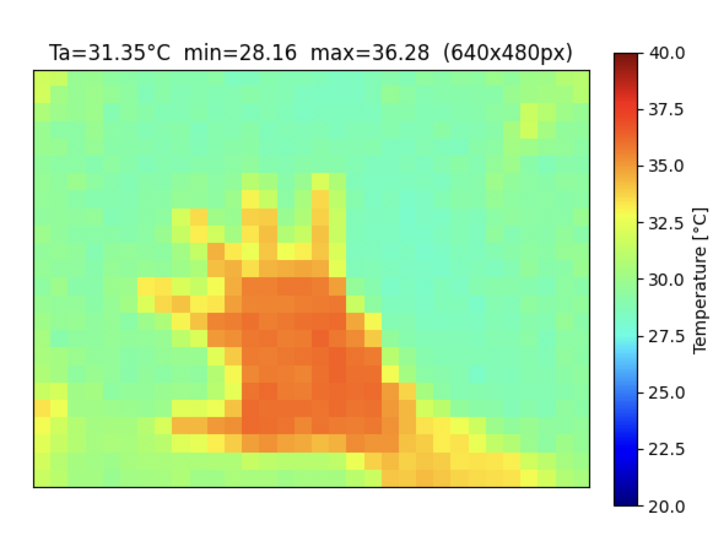

# MLX90640（サーマルセンサ 32×24）実装メモ

TerraGuard で使うサーマルセンサ。**110°広角版**（SparkFun Breakout は標準55°版なので、視野角の違いに注意）。

- 原本データシート: [`MLX90640_Datasheet_Melexis.pdf`](./MLX90640_Datasheet_Melexis.pdf)（Melexis, Rev.11）

## 基本仕様

| 項目 | 値 |
| --- | --- |
| 画素数 | **32×24 = 768画素**（FIR） |
| インターフェース | **I²C**（最大1MHz、EEPROMアクセス時は400kHzまで） |
| **I²C スレーブアドレス** | **0x33**（デフォルト、プログラム可能） |
| 電源電圧 | **3.3V** |
| リフレッシュレート | 0.5Hz〜64Hz（プログラム可能） |
| NETD | 0.1K RMS @1Hz |
| 視野角 | 今回は **110°版**（広角） |
| 測定対象温度 | -40℃〜300℃ |

## メモリ／レジスタ構成（16bitワード単位、I²Cは16bitアドレス）

| 領域 | アドレス範囲 | 用途 |
| --- | --- | --- |
| EEPROM | 0x2400〜0x273F | 校正パラメータ（起動時に全部読み出して保持） |
| RAM | 0x0400〜0x073F | 画素データ・Ta・VDD等（測定結果） |
| Status register | **0x8000** | サブページ更新フラグ、データ準備完了 |
| Control register1 | **0x800D** | リフレッシュレート、解像度、読み出しパターン（chess/interleaved）、サブページモード |
| I²C config register | **0x800F** | I²C動作設定 |

### Status register (0x8000) 主要ビット
- データ準備完了フラグ（新フレーム取得済み）
- どのサブページ(0/1)が更新されたか

### Control register1 (0x800D) 主要設定
- リフレッシュレート設定
- 解像度（ADC）
- 読み出しパターン: **Chess pattern（工場デフォルト・推奨）** / Interleaved
- サブページモード有効化

## 読み出しの基本フロー

```text
1. 起動時: EEPROM(0x2400〜)を全読み出し → 校正パラメータをRAMに保持
2. Control register1 (0x800D) でリフレッシュレート・パターン設定
3. ループ:
   a. Status register (0x8000) をポーリングし、新データ準備完了を待つ
   b. RAM (0x0400〜) からサブページの画素データを読む
   c. 校正パラメータを使って生データ → 温度[℃] に変換
   d. サブページ0と1の両方が揃うと1フレーム(32×24)完成
```

> MLX90640 は1フレームを2サブページ（chessパターン）に分けて更新する。32×24の全画素を得るには両サブページを読む。

## TerraGuard での前処理（[../sensor-processing.md](../sensor-processing.md)）

- **取得直後に 32×24（生）→ `rotate_crop`（90度右回転＋中央24行crop）→ 24×24=576** に整える（センサを90度回転して取り付けているため）。**以降のすべての処理（背景差分・特徴量化・バイナリ送出・NPU入力・データ収集）は 24×24 で行う**（旧設計の「16×12縮小」は廃止）。
- 背景差分・時間差分
- 平均/最大温度変化量、熱源の重心・移動量、変化継続時間 を特徴量化

## FRDM-MCXN947 への接続

- **I²C**（LPI2C または I3C のI²C互換モード）で接続。Arduino R3 / mikroBUS ヘッダを利用。
- 3.3V 電源。SCL/SDA にプルアップ必要（Breakout基板に実装済みのことが多い）。
- VL53L5CX と同一バス共存可（アドレス 0x33 と 0x29 で衝突しない）。

## ライブラリ（実装済み）

- **Melexis 公式ドライバ（Apache-2.0）を移植して使用**。MCUXpresso SDK には専用コンポーネントが無い。
- 配置: `src/FRDM-MCXN947/terra-guard-ai/vendor/mlx90640/`
  - `MLX90640_API.c` / `.h` … 公式原文（EEPROM展開・温度変換、OS非依存。`math.h` のみ）。
  - `MLX90640_I2C_Driver.h` … 公式原文（プロトタイプ宣言）。
  - `mlx90640_i2c_lpi2c.c` … **自前(BSD-3)** の I²Cドライバ層。`LPI2C_MasterTransferBlocking`
    （`subaddress`=16bitレジスタ, `subaddressSize=2`, MSBファースト）で実装。
- 主要 API 呼び出し順（実装済み・`led_blinky.c`）:
  `SetRefreshRate(2Hz) → SetChessMode → DumpEE → ExtractParameters`（起動時1回）→
  ループで `GetFrameData → GetTa → CalculateTo(放射率0.95, tr=Ta-8)`。

## ✅ 動作確認済み（2026-06-17）

- J8 pin1〜4（LPI2C2/FC2）に接続し、32×24 の校正済み温度[℃]フレームを取得・シリアル出力。
- 室温で Ta≈31℃ / 画素 min≈27.6℃・max≈33℃・avg≈28.8℃。オンボード温度センサ(P3T1755, I3C)とも整合。
- フレームを Python（`tools/thermal_viewer.py`）で受信しヒートマップ化。手をかざすと体温域(36℃)がはっきり写る。



## 実装上のハマりどころ（重要）

1. **大容量連続リードでハング**: EEPROM(832ワード=1664B) や画素(768ワード)を LPI2C の単一
   トランザクションで読むと `LPI2C_MasterTransferBlocking` がハングする。
   → `MLX90640_I2CRead` を **32ワードずつ分割読み出し**に実装（アドレスを更新して連続読み）。
2. **スタックオーバーフロー → HardFault**: `MLX90640_ExtractParameters` 内の
   `ExtractAlpha/Kta/KvPixelParameters` が `float[768]`(各3KB) のローカル配列を使う。
   デフォルトスタック 0x800(2KB) では溢れて HardFault。
   → CMake で `mcux_add_linker_symbol(SYMBOLS __stack_size__=0x4000)` に拡張。
3. スキャン(低レベル Start/Stop)後はバス状態をクリーンにするため、フレーム取得前に LPI2C を再初期化。

## 注意点

- EEPROM書き換え時は事前に該当セルへ 0x0000 を書く（消去）必要あり。
- 110°版は広角ゆえ周辺画素の歪み・感度低下に注意。
- 16bitレジスタアドレス・16bitデータのMSBファースト。
- Chess パターンでは1フレーム=サブページ0/1の両方。起動直後の1フレーム目は片サブページのみで
  min/center が 0 になることがある（2フレーム目以降は正常）。
