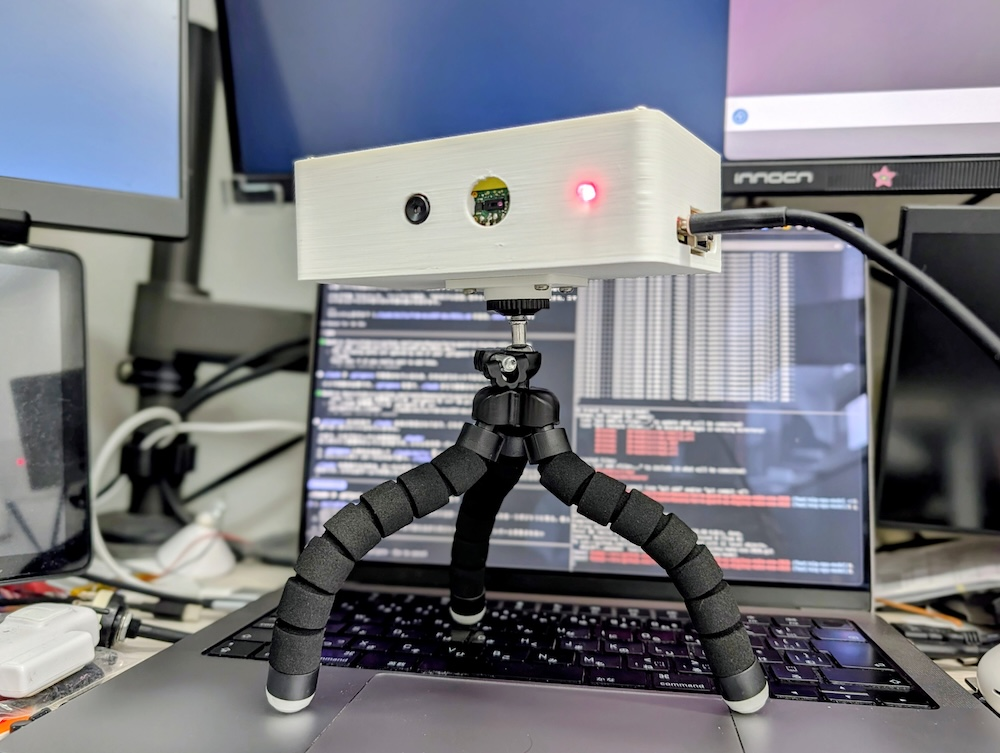
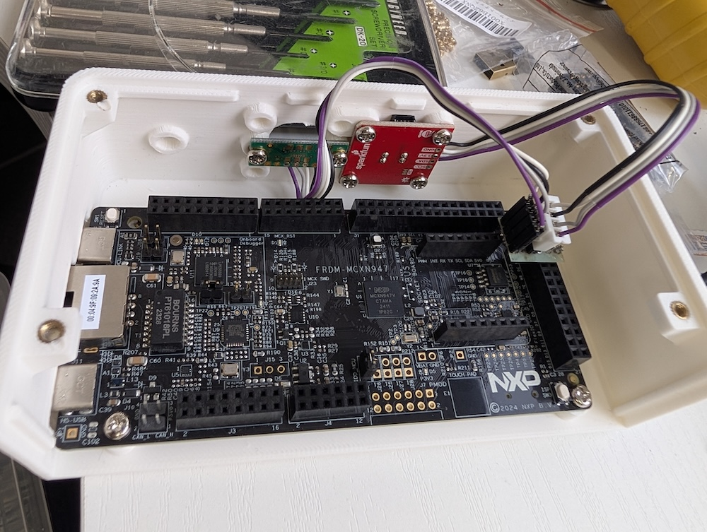

# ハードウェア — 使用部品・配線・システム構成

| 完成体（3Dプリント外装） | 内部（FRDM-MCXN947 ＋ センサ2個の結線） |
| :---: | :---: |
|  |  |

## 部品一覧

### 1. サーマルセンサ — MLX90640（視野角110°版）

SparkFun MLX90640 Thermal Camera Breakout
<https://www.sparkfun.com/products/14843>

用途：

- 32×24 の低解像度サーマル画像を取得
- ゴミ置き場周辺の温度分布を取得
- 背景との差分から、熱源の出現や移動を検出

備考：

- 今回の試作では 110° 版を使用する（広角のため近距離でゴミ置き場全体を捉える用途に向く）
- **解像度の扱い**: センサ生は 32×24=768 だが、**取得直後に `rotate_crop()`（90度右回転＋中央24行crop）で 24×24=576 に整える**（センサを90度回転して取り付けているため）。背景差分・特徴量・**NPU入力まで、すべての処理は 24×24** で行う（旧設計の「16×12へ縮小」は廃止）。
- インターフェースは I2C

---

### 2. ToF距離センサ — VL53L5CX

用途：

- 8×8 のマルチゾーン距離データを取得
- ゴミ袋の形状変化を検出
- カラスがゴミ袋の上に乗る、袋を引っ張る、周辺で動くなどの奥行き変化を取得

備考：

- 8×8 の距離マップをそのまま特徴量として利用可能
- サーマルでは見えにくい夏場や高温背景に対して、距離変化で補完する
- インターフェースは I2C

---

### 3. 制御・AIボード — NXP FRDM-MCXN947

本プロジェクトの中核ボード。センサを直接接続し、取得・前処理・AI推論まで単体で完結する。外部のArduino等の中継ボードは使用しない。

| 項目 | 内容 |
| --- | --- |
| MCU | MCXN947（**デュアル Arm Cortex-M33、最大150MHz** + DSP コプロセッサ） |
| AIアクセラレータ | **eIQ Neutron NPU**（エッジAI推論を高速・低消費電力で実行） |
| メモリ | 最大 2MB デュアルバンク Flash（ECC RAM オプション） |
| センサ接続 | **I2C / I3C**（MLX90640・VL53L5CX を直接接続） |
| デバッガ | オンボード **MCU-Link**（USB接続のみで書き込み・デバッグ可。追加プローブ不要） |
| 拡張 | Arduino シールド互換ヘッダ、MikroElektronika Click、Pmod |
| 開発環境 | **MCUXpresso SDK**（MCUXpresso IDE / VS Code 拡張） |

用途：

- MLX90640 と VL53L5CX を I2C で直接取得
- センサデータの前処理（差分マップ生成、特徴量抽出）
- カラス検出のAI推論（eIQ / 必要に応じて Neutron NPU を活用）またはルールベース判定
- 検出結果に応じた出力（今回はLED等での通知、後続で追い払い機構）

このボードを使う理由：

- eIQ Neutron NPU によりエッジで低消費電力AI推論ができる
- I2C/I3C でサーマル・距離センサを直接扱える
- オンボード MCU-Link で開発・デバッグが容易
- DigiKey で入手可能

---

## システム構成

```text
MLX90640 110°
32×24 サーマルアレイ
        │
        │ I2C
        ▼
┌─────────────────────────────┐
│  NXP FRDM-MCXN947           │
│   Cortex-M33 ×2 + DSP       │
│   + eIQ Neutron NPU         │
└─────────────────────────────┘
        ▲
        │ I2C
        │
VL53L5CX
8×8 ToF距離センサ
```

ボード上で行う処理：

```text
1. サーマルデータ取得
2. 距離データ取得
3. 背景フレームとの差分計算
4. 時間差分の計算
5. 重心位置・変化量などの特徴量抽出
6. カラス検出の判定（AI推論 / ルールベース）
7. 検出結果の出力（今回はLED等での通知）
```

---

## ピン配置（ピンレイアウト図）

FRDM-MCXN947 の全ヘッダのピン配置は [pin-layout.png](./pin-layout.png) を参照（配線時の早見図）。

## 外部センサ（MLX90640 / VL53L5CX）の I2C 配線

外部I²Cセンサは **バス LPI2C2 / FLEXCOMM2**（P4_0=SDA / P4_1=SCL）に接続する。オンボード温度センサ(I3C1)とは別バスで独立。このバスは複数のヘッダに引き出されており、**どれを使っても電気的に同一バス**（同じ P4_0/P4_1）。

### 推奨: J8（FlexIO ヘッダ）pin1〜4 ← **疎通確認済み**

| センサ側 | J8 ピン | 信号 / MCU |
| --- | --- | --- |
| **VCC** | **J8 pin 1** | **3.3V (P3V3)** |
| **GND** | **J8 pin 2** | **GND** |
| **SCL** | **J8 pin 3** | I2C_SCL / **P4_1**（FC2_I2C_SCL） |
| **SDA** | **J8 pin 4** | I2C_SDA / **P4_0**（FC2_I2C_SDA） |

- **コネクタ実装済み**なので追加ハンダ付け不要。電源・GND・I²Cがpin1〜4に隣接して並び、センサ1個ぶんが最短で配線できる。
- **✅ MLX90640 を J8 pin3/4 に接続し、起動時 I²Cスキャンで 0x33 の ACK を確認済み**（[firmware.md](./firmware.md) 参照）。

```text
FRDM-MCXN947                     センサ(MLX90640 / VL53L5CX)
  J8 pin1 (P3V3, 3.3V) ───────── VCC/VIN
  J8 pin2 (GND)        ───────── GND
  J8 pin3 (P4_1, SCL)  ───────── SCL
  J8 pin4 (P4_0, SDA)  ───────── SDA
```

### 代替: J2（Arduino ヘッダ）pin18/20 — J8 と同一バス

| センサ側 | 接続先 | 信号 / デバイスピン |
| --- | --- | --- |
| **SDA** | **J2 pin 18** | ARD_D18 / **P4_0**（FC2_I2C_SDA） |
| **SCL** | **J2 pin 20** | ARD_D19 / **P4_1**（FC2_I2C_SCL） |
| **VCC** | **J3 の P3V3（3.3V）** | 3.3V（5Vピンは使わない） |
| **GND** | J2/J3 の GND | — |

> J8 pin3/4 と J2 pin18/20 は**同じ P4_0/P4_1（同一 FC2 バス）**。電源/GNDの取り回しの都合で選んでよい。

### 別系統が欲しい場合: J7（Pmod）pin6/8/10/12 — 独立 FC7 バス（要ハンダ付け）

2本目の独立 I²C バスが必要なときは J7 を使える。**ただし J7 はコネクタDNP（未実装）でヘッダのハンダ付けが必要**。

| J7 ピン | 信号 / MCU |
| --- | --- |
| 6 | FC7_I2C_SCL / P3_3（SJ12 デフォルトのまま） |
| 8 | FC7_I2C_SDA / P3_2 |
| 10 | GND |
| 12 | 3.3V (P3V3) |

> J7 は別バス（**LPI2C7 / FLEXCOMM7**）。ソフトは FC7 用に別途セットアップが必要。当面は J8/J2(FC2) を主に使い、2系統に分ける必要が出たら検討する。

### 共通の注意

- 信号は **3.3V レベル**。MLX90640・VL53L5CX とも3.3V直結OK（レベル変換不要）。
- ソフト側は「pin_mux で P4_0/P4_1 を FC2 に割当 + `CLOCK_AttachClk(kFRO12M_to_FLEXCOMM2)` + `prj.conf` にドライバ」の3点セット（[firmware.md](./firmware.md) のペリフェラル追加手順参照）。

## I2C アドレスの注意

MLX90640（0x33）と VL53L5CX（0x29）は同一 I2C バス上に共存可能（アドレス衝突なし）。複数センサ接続時のプルアップ・電源容量に注意する。Breakout基板は通常プルアップ実装済み。各センサ単体での疎通（I²Cスキャンでの ACK 確認）を先に済ませてから統合する。

---

関連: [sensor-processing.md](./sensor-processing.md) / [firmware.md](./firmware.md) / [datasheets/](./datasheets/)
