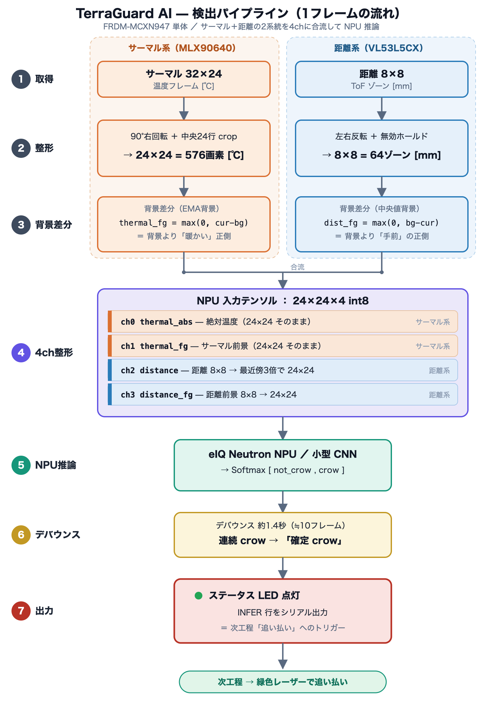

# センサデータ処理 — カラス検出の仕組み（前処理・前景抽出・NPU推論）

> **今回のスコープ: カラスの検出のみ。** 「人によるゴミ出し」など他状態の分類は将来拡張。処理はすべて FRDM-MCXN947 単体（Cortex-M33 + eIQ Neutron NPU）で完結する。カメラを使わず、クラウドにも依存しない。

このドキュメントは、**実装コード（`src/FRDM-MCXN947/terra-guard-ai/app/`）の現状ロジックをそのまま落とし込んだもの**である。サーマル（MLX90640）と距離（VL53L5CX）の2センサを **背景差分で前景化** し、それを **4チャンネル 24×24 のテンソル** にまとめて **eIQ Neutron NPU の小型 CNN** に通し、**時間方向のデバウンス**を経てカラスを確定検出する。各処理が「なぜそうしているか（狙い）」も併記する。

関連ファイル:

| 役割 | ファイル |
| --- | --- |
| サーマル取得・回転crop・段差補正 | `app/thermal_mlx90640.c` |
| 距離取得・ホールド・左右反転 | `app/tof_vl53l5cx.c` |
| 背景差分・前景抽出・候補判定 | `app/bg_subtract.c` |
| NPU 入力整形・量子化・推論 | `app/npu_infer.c` |
| メインループ・デバウンス・LED | `led_blinky.c`（`main()`） |
| 学習側の前処理（ファームと厳密一致） | `tools/ml/build_trainset.py` |
| CNN 構造・int8量子化 | `tools/ml/train_model.py` |

---

## 0. 全体パイプライン（1フレームの流れ）

<p align="center">
  
</p>

```text
┌─ MLX90640 (サーマル, 生32×24) ──┐         ┌─ VL53L5CX (距離, 8×8 = 64ゾーン) ─┐
│  サブページ0/1 が揃ったら完成      │         │  高頻度ポーリング, status判定+ホールド │
│  ① 段差補正(dechess)             │         │  ② 左右反転(flip_h) + 無効=-1        │
│  ② 90度右回転＋中央24行crop       │         │                                    │
│     → 24×24=576画素[℃]           │         │     → 8×8=64ゾーン[mm]               │
└──────────────┬──────────────┘         └─────────────┬──────────────┘
               │                                        │
        ③ 背景差分(EMA背景)                       ③ 背景差分(中央値背景)
        thermal_fg = max(0, cur-bg)[℃]          dist_fg = max(0, bg-cur)[mm]
        （背景より「暖かい」正の差）              （背景より「手前」に出た正の差）
               │                                        │
               ▼                                        ▼
        ┌────────────────── ④ NPU 入力整形 (24×24×4 int8) ──────────────────┐
        │  ch0 thermal_abs : サーマル絶対温度   24×24 をそのまま              │
        │  ch1 thermal_fg  : サーマル前景       24×24 をそのまま              │
        │  ch2 distance    : 距離(8×8)          最近傍3倍 → 24×24             │
        │  ch3 distance_fg : 距離前景(8×8)      最近傍3倍 → 24×24             │
        └───────────────────────────┬──────────────────────────────┘
                                     │
                            ⑤ eIQ Neutron NPU 推論
                            小型CNN → Softmax [not_crow, crow]
                                     │
                            ⑥ 時間デバウンス（10連続でcrow確定）
                                     │
                            ⑦ ステータスLED 点灯 / INFER 行をシリアル出力
```

完成サーマルフレームは実測 **約7fps**。NPU 推論は**サーマル完成フレームごと**（＝約7回/秒）に1回駆動する。距離は約10Hz でポーリングするが、推論は常に「最新の距離前景」と「いま揃ったサーマル前景」を組み合わせて行う。

**狙い**: 単一センサでは誤検出が避けられない。サーマル単独だと日なたの壁・路面が熱源として誤反応し、距離単独だと人・車・物の通過に反応する。**サーマル（温度）と距離（奥行き）を4chに束ねて1つの CNN に同時入力**することで、「暖かくて・かつ・背景より手前に出た・小さなまとまり」というカラス特有の同時条件を学習で取り出す。これがプライバシー配慮（カメラ非使用）と低消費電力（オンデバイス）を両立する核心。

---

## 1. サーマル前処理（MLX90640 → 24×24）

> **処理解像度は一貫して 24×24。** MLX90640 の**生**出力は 32×24=768点だが、**取得直後に 24×24=576点へ整形**し、以降の全処理（背景差分・前景・統計・バイナリ送出・NPU入力・データ収集）は 24×24 で行う。「32×24」と書けるのはセンサ生仕様の説明のときだけ。

実装: `app/thermal_mlx90640.c`

### 1-1. 完成フレームの組み立て（Chessモード）

MLX90640 は Chess パターンで **サブページ0/1 を市松状に交互測定**する。リフレッシュ16Hz設定（サブページ単位）で、**完成フレーム（0/1両方が揃った状態）は約半分の ~7fps**。`poll_frame()` は data-ready を非ブロッキングで確認し、サブページ0と1の両方が揃った瞬間だけ「完成」とみなす（`s_subpageSeen == 0x03`）。

- **狙い**: 片サブページだけで描画すると動体時に市松模様（片半分が古い）が出る。両サブページ完成を待つことで動きのある対象でも崩れない。

### 1-2. サブページ段差補正（dechess）

Chess モードはサブページ0/1間に **系統的なオフセット差（実機で約1〜1.6℃）** がある。生フレーム（行24×列32）に対し、各サブページの**中央値** m0/m1 を求め、全体平均に揃うよう subpage0 に `-(m0-m1)/2`、subpage1 に `+(m0-m1)/2` を加える。

- **狙い**: 背景差分の前景は `max(0, cur-bg)` の正側だけを取るため、サブページ段差を放置すると**生サーマルは市松でないのに前景だけ市松模様**になる（片サブページだけが一様に閾値を超える）。段差補正で根本除去する。中央値ベースなので画面内に本物の熱源があっても段差推定が引っ張られにくい。

### 1-3. 90度右回転＋中央24行crop（`rotate_crop`）

センサを物理的に90度回転して取り付けているため、生フレーム（行R=24×列C=32）を**時計回り90度回転**し、回転後の32行のうち**上下を落として中央24行をcrop**、正方の **24×24=576画素** にする。

```text
dst[oi*24 + j] = src[(R-1-j)*C + (oi+4)]   （R=24, C=32, 上4行カット）
```

- **狙い**: 正立かつ正方の画像にすることで、距離(8×8→24×24)と画素位置の対応が素直になり、CNN が空間特徴を学習しやすい。回転・cropは**ファームで確定**し、学習側（`build_trainset.py` の `shape_thermal()`＝無加工）と厳密一致させている。

---

## 2. 距離前処理（VL53L5CX → 8×8）

実装: `app/tof_vl53l5cx.c`。解像度 8×8（64ゾーン）、10Hz、積分時間33ms、シャープナー20%。**回転はしないが左右反転**する。

### 2-1. 信頼度フィルタとホールド

各ゾーンの `target_status` を見て **有効測距（status ∈ {5,6,9,10}）かつ 0〜4000mm** のときだけ距離を更新する。低信頼ゾーンは瞬間的にゴミ距離（例: 2000→300mm）を返すので、そのフレームは捨て、ゾーンごとに保持した**最後の有効値でホールド**する。無効が `VL53_HOLD_MAX`（10フレーム≒1秒）連続したら、古い値を引きずらないよう **無効(-1)** に倒す。

- **狙い**: 背景差分は背景との差を見るので、ゾーンが瞬間的にゴミ値を返すと前景が誤爆する。ホールドでフレーム間のちらつきを抑え、ホールド切れの -1 で「対象なし」を明示する。

### 2-2. 左右反転（`vl53_flip_h`）

取り付け向き補正として 8×8 を左右反転（`row*8 + (7-col)`）し、サーマルと画素の左右を揃える。`s_distHeld`（DIST出力・NPU入力・背景差分が見る側）を反転後の向きで保持する。

---

## 3. 背景差分による前景抽出（カラス検出の心臓部）

実装: `app/bg_subtract.c`。**「背景モデルを持ち、いま現れた差分（前景）だけを取り出す」**のがこの段の役割。サーマルと距離で背景の作り方・前景の向きが異なる。

### 3-1. 背景モデルの確立と更新

| | サーマル | 距離 |
| --- | --- | --- |
| 初期化 | 起動後 **40フレームの平均**（≒5〜6秒） | 起動後 **40フレームのゾーンごと中央値**（無効ゾーンは積まない） |
| 逐次更新 | EMA `α=0.01`（日射・気温変化に追従、少し速め） | EMA `α=0.005`（固定物中心なので遅め） |
| 更新タイミング | **そのセンサの前景が立っていない間だけ更新（立っている間は凍結）** | 同左 |

- **中央値で距離背景を作る狙い**: 起動中に瞬間ノイズが混ざっても、平均より中央値の方が外れ値に強い。
- **センサごとに独立して凍結する狙い（重要）**: 旧実装は「サーマル AND 距離」の候補成立時だけ背景を凍結していた。すると片方（例: サーマル）に前景が出ていても、もう片方の条件不成立で候補にならないと、前景が出ているサーマルの背景まで EMA 更新され続け、**途中で現れたカラスが数秒で背景に吸収されて前景が消える**バグが起きた。現在は **各センサが「自分の前景が立っている間は自分の背景を凍結」** する（`bg_apply_update_policy()`）。

### 3-2. サーマル前景

```text
thermal_fg[i] = max(0, cur[i] - bg[i])   （背景より「暖かい」正の差だけ）
```

前景画素とみなす下限は **+2.0℃**（`BG_THERMAL_FG_MIN_C`）。前景の最大差分 `t_max` と、+2.0℃以上の画素数 `t_area` を特徴量として保持する。

- **+2.0℃という閾値の狙い**: 1.0℃まで下げると前述のサブページ段差（約1〜1.6℃）を拾って市松が再発する。2.0℃ならサブページ差を超えるので安全。一方、カラスの**羽毛表面温度は約30〜35℃**（後述）で、近接・大きく写れば背景と2℃以上の差は出る前提。
- **正側（暖かい側）だけ取る狙い**: カラスは背景より暖かい熱源。冷たい側の差分（影など）は不要。

### 3-3. 距離前景（陸上カラス対応の複合判定）

```text
dist_fg[z] = max(0, bg[z] - cur[z])   （背景より「手前」に出た正の差だけ）
```

距離前景は**ヒステリシス付き**: ゾーンは ON閾値 **30mm** で点灯し、OFF閾値 **15mm** を下回るまで点灯を維持する。境界でのσ揺れによるちらつきを防ぐ。

ただし「ON=30mm の単一ゾーン絶対値」だけでは誤検出が止まらない。**地面に立つ陸上カラスは、背景=地面との距離差が体高ぶん 15〜20cm（最大80mm）しか出ず**、地面ノイズ床（σ p90 41mm / 変動幅 max 126mm）と重なって**単一閾値では分離不能**だからである。そこで **まとまり（連結塊）を見る複合判定** を導入した:

```text
距離側カラス候補あり ⇔
   ( 最大連結塊サイズ ≥ 2px  かつ  その塊内の前景合計 ≥ 100mm )   ← distCluster
 または
   ( 前景 上位3ゾーン和 ≥ 120mm )                                ← distTop3
```

連結塊は前景マップ `s_distFg` を 8×8 グリッドとみなし、点灯ゾーン(fg>0)の **4近傍連結成分を反復DFS** で走査して最大塊のサイズと合計を求める。

- **狙い**: カラスは隣接ゾーンが連結して反応し前景総和が大きい。地面ノイズは単発・散発なので連結も総和も伸びず弾かれる。「まとまった反応」だけを陸上カラス候補とする。（実機検証 2026-06-22 / `tools/ml/test_foreground_detect.py` で保存データの あり/なし 完全分離を確認）

### 3-4. ルールベースの候補判定（背景凍結とログ用）

```text
candidate = hasThermalFg AND hasDistFg
  hasThermalFg = (t_max ≥ 2.0℃) AND (t_area ≥ 4)
  hasDistFg    = distCluster OR distTop3
```

この `candidate` は **DET 行としてシリアル出力**され、また背景凍結ロジックの参考になる（実際の凍結はセンサ独立判定）。

- **狙い**: AND で絞ることで、熱だけ／距離だけの単独反応を弾く。**ただしこの AND 判定は最終的なカラス確定ではない**。最終判定は次段の NPU が行う。ルールベースは「背景に吸収させない（前景を保持する）」ための土台と、開発時の可視化のために残している。

---

## 4. NPU 入力テンソルの整形（24×24×4 int8）

実装: `app/npu_infer.c`（`npu_infer_run()`）。学習側 `build_trainset.py` と**前処理・正規化レンジ・量子化を厳密一致**させている（一致しないと NPU の判定が学習時とずれる）。

### 4-1. 4チャンネルの構成

| ch | 内容 | ソース | 形状合わせ | 正規化レンジ |
| --- | --- | --- | --- | --- |
| **ch0** | thermal_abs（絶対温度） | サーマル24×24[℃] | そのまま | `[15, 45]℃` → 0..1 |
| **ch1** | thermal_fg（サーマル前景） | サーマル前景24×24[℃,≥0] | そのまま | `[0, 5]℃` → 0..1 |
| **ch2** | distance（絶対距離） | 距離8×8[mm] | **最近傍3倍 → 24×24** | `[0, 4000]mm` → 0..1 |
| **ch3** | distance_fg（距離前景） | 距離前景8×8[mm,≥0] | **最近傍3倍 → 24×24** | `[0, 500]mm` → 0..1 |

- 距離の最近傍3倍は `np.kron`（学習側）／ファームでは `dr = y/3, dc = x/3` のインデックス展開で等価。
- 距離の**無効ゾーン(-1)は遠方相当（4000mm）**として扱う（学習側 `nan→D_VMAX` と一致）。

**狙い（なぜ絶対値と前景の両方を入れるか）**:
- **前景（ch1/ch3）** は「いま動いた・現れたもの」を表す（背景差分の出力）。カラスの存在そのものを示す主信号。
- **絶対値（ch0/ch2）** は「その対象が何℃で・何mmにあるか」という文脈を CNN に与える。例えば前景が出ていても、絶対温度が背景同然なら誤反応、35℃近辺で背景より手前なら本物、という判断を学習で獲得できる。前景だけでは温度・距離の絶対水準が失われるため両方入れる。

### 4-2. 量子化（float 0..1 → int8）

各チャンネルを 0..1 にクリップ後、入力テンソルの量子化に合わせて int8 化する:

```text
q = round(x / scale) + zero_point      scale = 1/255 (≈0.003921569),  zero_point = -128
```

学習時の representative_dataset による full-integer 量子化（`train_model.py`）の入力スケールと一致させた固定値で再現している。テンソルレイアウトは `[H=24][W=24][C=4]` の行優先（`in[(y*24 + x)*4 + c]`）。

---

## 5. eIQ Neutron NPU でのCNN推論

実装: モデル構造は `tools/ml/train_model.py`、推論呼び出しは `app/npu_infer.c` ＋ `tflm/`（TFLite Micro + Neutron グラフ）。

### 5-1. モデル構造（NPU対応opのみ）

```text
Input [24,24,4]
  Conv 8  3x3 relu → MaxPool2   → 12x12x8
  Conv 16 3x3 relu → MaxPool2   → 6x6x16
  Conv 24 3x3 relu → AvgPool(6,6) → Flatten   → 24
  Dense 2 softmax
Output [1,2]  = [p_not_crow, p_crow]
```

- GlobalAveragePooling は Neutron 変換(MLIR)で落ちるため、明示サイズの `AveragePooling2D(6,6)` + `Flatten` で代替している。
- 2クラス（`not_crow`=0 / `crow`=1）の Softmax 確率を出す。

### 5-2. 出力の逆量子化と判定

出力テンソル [1,2] は int8。逆量子化して確率に戻す:

```text
p0 = (outq[0] - zp) * scale   （not_crow）   scale = 1/256 (=0.00390625), zp = -128
p1 = (outq[1] - zp) * scale   （crow）

raw_crow   = (p1 ≥ p0)        … この1フレームの生判定
p_crow     = p1
confidence = max(p0, p1)
```

この `raw_crow` は**1フレーム単位の生判定**であり、まだ確定ではない。

- **狙い（NPUを使う理由）**: 背景差分のルールだけでは「前景が出た＝カラス」までしか言えず、人・揺れる物・日なたの誤反応を切り分けられない。CNN は4chの空間パターン（温度分布の形・距離のまとまり・両者の重なり方）からカラスらしさを学習で判別する。推論はオンチップの **eIQ Neutron NPU** で実行するため低消費電力・低レイテンシで、クラウドに画像を送らない（プライバシー配慮）。

---

## 6. 時間方向デバウンス（確定検出）

実装: `led_blinky.c` の `main()`。`CROW_CONFIRM_FRAMES = 10`。

```text
raw_crow が来るたび:
   crow なら  streak++（上限255）
   not_crow なら streak = 0
confirmed = (streak ≥ 10)        … 確定crow
```

サーマル完成フレームは約7fps なので、**10連続 ≒ 約1.4秒のあいだ連続して crow** と判定されたときだけ「確定crow」とする。解除は即時（not_crow が1回来たら streak=0 で確定を落とす）。

- **狙い**: 静止背景でも生判定 `raw_crow` は境界（p_crow≈0.5）で単発的に揺れることがある。10連続を要求することで**単発スパイクの誤点灯を抑える**。一方、解除を即時にするのは、カラスが去ったあとに点灯が残らないようにするため（追い払い動作の誤発火を避ける）。

---

## 7. 出力（シリアルフォーマット）

メインループは同一シリアル上に、行頭マーカ／magic でテキストとバイナリを混在出力する。ホスト側ビューア（`tools/dual_viewer_web.py`）が分離して可視化する。

| 出力 | 形式 | 内容 |
| --- | --- | --- |
| `0xAA55` + Ta + 576×int16 | バイナリ | 生サーマル（24×24, 1/100℃） |
| `0xAA56` + 576×int16 | バイナリ | サーマル前景（24×24, 1/100℃, ≥0） |
| `DIST,<z0..z63>` | テキスト | 距離8×8[mm]（-1=無効） |
| `STAT,<s0..s63>` | テキスト | 距離8×8 の target_status |
| `DFG,<z0..z63>` | テキスト | 距離前景8×8[mm] |
| `DET,<cand>,<t_max>,<t_area>,<d_max>,<d_area>,<d_cluster_size>,<d_cluster_sum>,<d_top3_sum>` | テキスト | ルールベース候補判定の要約（後半3つは距離複合判定の特徴量。後方互換で末尾追加） |
| `INFER,<確定crow 0/1>,<p_crow×1000>,<conf×1000>,<raw crow>,<streak>` | テキスト | NPU推論結果（確定はデバウンス後、raw/streak はデバッグ用） |

確定crow（`INFER` の先頭フィールド=1）の間だけ **ステータスLED(P1_22)** を点灯する（シンク駆動 Low=点灯）。

---

## 8. カラスのサーマル特性（しきい値設計の前提・重要）

サーマル前景閾値（`BG_THERMAL_FG_MIN_C`）を決めるうえで、**「カラスの体温」と「サーマルカメラで実際に見える表面温度」は別物**である点が重要。

| 対象 | 温度目安 | 備考 |
| --- | --- | --- |
| 深部体温 | 約 40〜42℃ | カラス本体の体温。羽毛に覆われ**直接は見えにくい** |
| 羽毛の表面 | 約 30〜35℃ | **MLX90640 で主に見えるのはここ** |
| 観測例 | 羽毛表面 約 34℃ | カラス研究で羽毛表面34℃、顔や胴体の方が高温と報告 |
| 日なたの黒い羽 | さらに高く見える可能性 | 黒い羽は日射で表面温度が上がりやすい |

- **検出ロジック上の目安**: サーマルで狙うべきは**羽毛表面 30〜35℃**（初期値34℃前後）。深部体温41℃を基準に閾値を組むと**実際の見え（34℃）と乖離して検出漏れ**するので避ける。
- **屋外運用の注意**: 日射で背景（地面・壁・ゴミ袋）が30℃台後半まで温まると羽毛表面34℃との差が縮み、前景に出にくくなる。`BG_THERMAL_FG_MIN_C`（現状 2.0℃）はこの状況を見越して調整する余地がある。

---

## 9. 学習側との一致（再学習時の鉄則）

NPU の判定が学習時と一致するには、**ファームの前処理と学習側の前処理を1対1で揃える**必要がある。以下は必ず一致させる:

| 項目 | ファーム | 学習側 |
| --- | --- | --- |
| サーマル整形 | `rotate_crop`（回転＋crop）済み 24×24 を無加工 | `shape_thermal()`＝無加工 |
| 距離拡大 | 最近傍3倍（`y/3, x/3`） | `np.kron`（3倍） |
| 正規化レンジ | T `[15,45]` / Tfg `[0,5]` / D `[0,4000]` / Dfg `[0,500]` | 同左（`build_trainset.py`） |
| 無効距離の扱い | -1 → 4000mm（遠方相当） | `nan → D_VMAX` |
| 入力量子化 | scale=1/255, zp=-128 | representative_dataset による full-integer 量子化 |

再学習〜NPUデプロイの手順は [ml-model.md](./ml-model.md) を参照。性能検証・誤検出の切り分けは `terra-guard-model-eval` スキル参照。

---

関連: [overview.md](./overview.md) / [hardware.md](./hardware.md) / [firmware.md](./firmware.md) / [ml-model.md](./ml-model.md)
